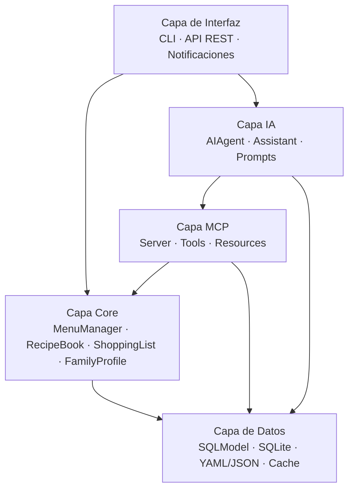
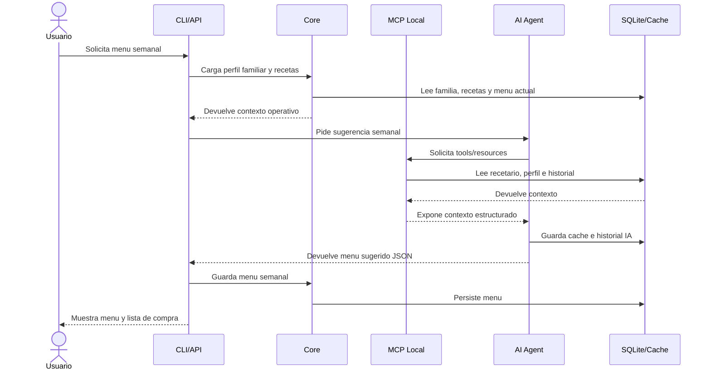
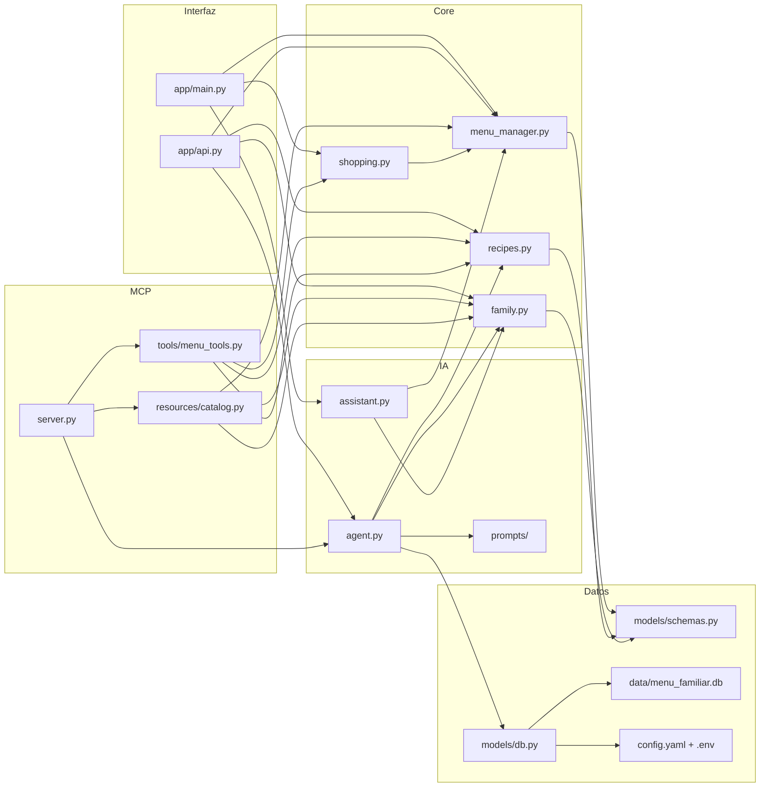

# Arquitectura del Gestor de Menus Familiares

## Objetivo

Este documento describe la arquitectura base del proyecto `menu_familiar`, pensado para gestionar menus semanales familiares, recetas, perfil de comensales, lista de la compra y sugerencias asistidas por IA.

La solucion esta organizada por capas para separar interfaz, logica de negocio, integracion con modelos, exposicion de contexto mediante MCP y persistencia local.

## Principios de diseno

- Separacion clara entre UI, dominio, integraciones y datos.
- Persistencia local sencilla con SQLite para facilitar uso domestico y despliegue ligero.
- Capacidad de operar en modo local sin depender de un proveedor IA real.
- Exposicion de herramientas y recursos mediante una capa MCP local.
- Posibilidad de evolucionar desde CLI a API y automatizaciones sin reescribir el core.

## Vista General

La aplicacion se divide en cinco capas:

1. Capa de interfaz.
2. Capa de logica de negocio.
3. Capa MCP.
4. Capa de inteligencia artificial.
5. Capa de datos.

### Diagrama de capas



## 1. Capa de Interfaz

La capa de interfaz expone la aplicacion a usuarios y clientes externos.

### CLI

Archivo principal: [app/main.py](/home/asuarez/claude/comidas/menu_familiar/app/main.py)

Responsabilidades:

- Inicializar la base de datos.
- Cargar datos demo.
- Mostrar el menu semanal.
- Generar sugerencias de menu.
- Consultar la lista de la compra.
- Interactuar con el asistente familiar.

Tecnologias:

- `typer`
- `rich`

### API REST

Archivo principal: [app/api.py](/home/asuarez/claude/comidas/menu_familiar/app/api.py)

Responsabilidades:

- Exponer endpoints CRUD basicos de menus, recetas y familia.
- Exponer endpoint de sugerencia IA.
- Exponer endpoint conversacional del asistente.
- Aplicar autenticacion basica.
- Publicar documentacion Swagger automaticamente.

Tecnologias:

- `fastapi`
- `uvicorn`

Despliegue local:

- `uv run -m app.main serve-api`
- Puerto por defecto: `8010`

### Interfaz web integrada

Directorio principal: [app/web](/home/asuarez/claude/comidas/menu_familiar/app/web)

Responsabilidades:

- Exponer una interfaz HTML para toda la funcionalidad existente.
- Reutilizar la autenticacion basica actual.
- Renderizar vistas server-side con formularios y navegacion por secciones.
- Mantener la API JSON y la web conviviendo sobre el mismo backend.

Tecnologias:

- `jinja2`
- `fastapi templating`
- `StaticFiles`

### Notificaciones

Archivo principal: [app/services/notifications.py](/home/asuarez/claude/comidas/menu_familiar/app/services/notifications.py)

Responsabilidades:

- Enviar recordatorios y avisos de forma opcional.
- Integrarse con `ntfy` como primer canal sencillo.

Estado actual:

- Implementacion base disponible.
- Scheduler aun no incorporado en este scaffold.

## 2. Capa de Logica de Negocio

La capa core concentra las reglas del dominio y no depende de la interfaz concreta.

### MenuManager

Archivo: [app/core/menu_manager.py](/home/asuarez/claude/comidas/menu_familiar/app/core/menu_manager.py)

Responsabilidades:

- Gestionar el menu semanal.
- Obtener la semana activa.
- Persistir sugerencias de menu.
- Agrupar el menu por dias.

### RecipeBook

Archivo: [app/core/recipes.py](/home/asuarez/claude/comidas/menu_familiar/app/core/recipes.py)

Responsabilidades:

- Crear y listar recetas.
- Buscar recetas por nombre.
- Exportar el recetario a YAML.
- Preparar una importacion basica desde URL.

### ShoppingList

Archivo: [app/core/shopping.py](/home/asuarez/claude/comidas/menu_familiar/app/core/shopping.py)

Responsabilidades:

- Generar la lista de la compra desde el menu semanal.
- Agregar ingredientes repetidos.
- Exportar la lista en texto plano.

Limitacion actual:

- El calculo de cantidades esta simplificado y todavia no escala ingredientes por raciones.

### FamilyProfile

Archivo: [app/core/family.py](/home/asuarez/claude/comidas/menu_familiar/app/core/family.py)

Responsabilidades:

- Gestionar miembros de la familia.
- Consolidar alergias y restricciones.
- Construir el contexto familiar para IA y MCP.
- Exportar el perfil familiar a JSON.

## 3. Capa MCP

La capa MCP permite exponer contexto y herramientas de dominio a un agente LLM.

### Servidor MCP local

Archivo: [app/mcp/server.py](/home/asuarez/claude/comidas/menu_familiar/app/mcp/server.py)

Responsabilidades:

- Exponer el menu semanal.
- Exponer el perfil familiar.
- Guardar menus sugeridos.
- Publicar tools y resources consumibles por un agente.

Nota:

- En este proyecto se implementa una version local simplificada, orientada a estructurar la integracion antes de conectar un runtime MCP formal.

### MCP Tools

Archivo principal: [app/mcp/tools/menu_tools.py](/home/asuarez/claude/comidas/menu_familiar/app/mcp/tools/menu_tools.py)

Tools implementadas:

- `search_recipe(query)`
- `list_available_ingredients()`
- `get_nutrition_info(dish)`
- `generate_shopping_list()`
- `get_family_profile()`

### MCP Resources

Archivo principal: [app/mcp/resources/catalog.py](/home/asuarez/claude/comidas/menu_familiar/app/mcp/resources/catalog.py)

Recursos publicados:

- Recetario disponible.
- Perfil familiar consolidado.
- Menu semanal actual.
- Inventario de ingredientes derivado del recetario.

## 4. Capa de Inteligencia Artificial

La capa IA encapsula prompts, sugerencia de menu y comportamiento conversacional.

### AI Agent

Archivo: [app/ai/agent.py](/home/asuarez/claude/comidas/menu_familiar/app/ai/agent.py)

Responsabilidades:

- Construir el prompt de planificacion.
- Integrar contexto familiar y recetario.
- Generar una propuesta semanal.
- Guardar historial de prompts y respuestas.
- Mantener cache local de sugerencias.

Estado actual:

- Proveedor por defecto: `mock`.
- La salida se produce en formato estructurado y persistible.

### Chat Asistente

Archivo: [app/ai/assistant.py](/home/asuarez/claude/comidas/menu_familiar/app/ai/assistant.py)

Responsabilidades:

- Responder preguntas sencillas sobre el menu.
- Ofrecer una capa conversacional basica.
- Preparar el terreno para memoria e interaccion mas rica.

### Prompt Engine

Archivo principal: [app/ai/prompts/menu_system_prompt.txt](/home/asuarez/claude/comidas/menu_familiar/app/ai/prompts/menu_system_prompt.txt)

Responsabilidades:

- Definir el rol del planificador de menus.
- Forzar restricciones y criterios familiares.
- Guiar la salida a un formato estructurado.

## 5. Capa de Datos

La capa de datos centraliza persistencia relacional, configuracion y cache.

### SQLite y SQLModel

Archivos:

- [app/models/db.py](/home/asuarez/claude/comidas/menu_familiar/app/models/db.py)
- [app/models/schemas.py](/home/asuarez/claude/comidas/menu_familiar/app/models/schemas.py)

Entidades principales:

- `FamilyMember`
- `Recipe`
- `MenuEntry`
- `AIHistory`

Persistencia:

- Base de datos local: [data/menu_familiar.db](/home/asuarez/claude/comidas/menu_familiar/data/menu_familiar.db)

### Configuracion

Archivos:

- [config.yaml](/home/asuarez/claude/comidas/menu_familiar/config.yaml)
- [.env](/home/asuarez/claude/comidas/menu_familiar/.env)

Responsabilidades:

- Parametrizar app, API, notificaciones y proveedor IA.
- Separar secretos del resto de configuracion.

### Cache y Estado

Responsabilidades:

- Cachear respuestas IA.
- Mantener historial de prompts.
- Preparar una futura memoria conversacional.

Tecnologia:

- `diskcache`

## Flujo Principal: Generacion de Menu Semanal con IA

El flujo principal previsto es el siguiente:

1. El usuario solicita un menu semanal desde la CLI o la API.
2. El core carga el perfil familiar y el recetario disponible.
3. La capa MCP puede exponer ese contexto como tools y resources para un agente.
4. El agente IA genera una propuesta de menu semanal estructurada.
5. `MenuManager` valida y persiste el resultado en SQLite.
6. La interfaz devuelve el menu semanal y permite generar la lista de compra.

### Diagrama de secuencia



## Estructura de Carpetas

```text
menu_familiar/
├── app/
│   ├── main.py
│   ├── api.py
│   ├── web/
│   ├── core/
│   │   ├── menu_manager.py
│   │   ├── recipes.py
│   │   ├── shopping.py
│   │   └── family.py
│   ├── mcp/
│   │   ├── server.py
│   │   ├── tools/
│   │   └── resources/
│   ├── ai/
│   │   ├── agent.py
│   │   ├── assistant.py
│   │   └── prompts/
│   ├── models/
│   └── services/
├── data/
│   └── menu_familiar.db
├── docs/
│   └── arquitectura.md
├── config.yaml
├── .env
├── requirements.txt
└── README.md
```

### Diagrama de modulos



## Decisiones Tecnicas

- `FastAPI` se usa para exponer una API ligera y documentada automaticamente.
- `Typer` simplifica la capa CLI y mantiene coherencia con el ecosistema de Python moderno.
- `SQLModel` unifica validacion y persistencia con bajo coste de complejidad.
- `SQLite` es suficiente para un escenario familiar local y evita infraestructura adicional.
- `diskcache` permite cache local rapida sin introducir Redis u otros componentes.
- La capa MCP se mantiene desacoplada del core para facilitar evolucion futura.

## Limitaciones Actuales

- No hay migraciones Alembic configuradas aun.
- No hay integracion real con OpenAI o Claude.
- No hay tests automaticos.
- La importacion de recetas desde URL es un placeholder.
- El asistente conversacional todavia es basico.
- No existe scheduler para notificaciones periodicas.

## Evolucion Recomendada

1. Anadir migraciones Alembic y versionado de esquema.
2. Incorporar tests unitarios e integracion.
3. Implementar proveedor IA real y parser robusto de respuesta JSON.
4. Completar CRUD de menus, recetas y familia en API y CLI.
5. Mejorar el calculo nutricional y el escalado por raciones.
6. Sustituir el MCP local simplificado por un servidor MCP formal si el proyecto lo requiere.
